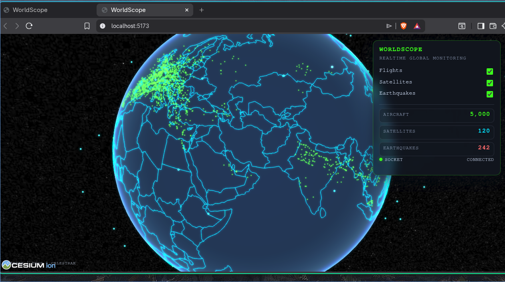

# WorldScope

WorldScope is an open-source, real-time global monitoring MVP.
It combines a 3D Cesium globe with live streams for flights, satellites, and earthquakes.


## Features

- 3D interactive globe powered by CesiumJS
- Real-time flight tracking (OpenSky states feed)
- Real-time satellite tracking from TLE propagation (`satellite.js`)
- Real-time earthquake monitoring (USGS all-day feed)
- WebSocket streaming via Socket.IO
- Layer toggles for flights, satellites, and earthquakes
- Live stats panel (aircraft, satellites, earthquakes)
- Tactical dark UI with low-overhead rendering (`requestRenderMode`)

## Tech Stack

Frontend:
- Vite (vanilla JavaScript)
- CesiumJS
- Socket.IO Client

Backend:
- Node.js + Express
- Socket.IO
- Axios
- `satellite.js`
- CORS

## Project Structure

```text
worldscope/
├── frontend/
│   ├── index.html
│   ├── package.json
│   ├── vite.config.js
│   ├── style.css
│   └── src/
│       ├── main.js
│       ├── globe/
│       │   ├── initGlobe.js
│       │   ├── flightLayer.js
│       │   ├── satelliteLayer.js
│       │   └── earthquakeLayer.js
│       ├── services/
│       │   └── socket.js
│       └── ui/
│           └── controls.js
└── backend/
    ├── package.json
    ├── server.js
    └── services/
        ├── flightService.js
        ├── satelliteService.js
        └── earthquakeService.js
```

## Data Update Cadence

- Flights: every **10 seconds**
- Satellites: every **1 second**
- Earthquakes: every **30 seconds**

Performance behaviors implemented:
- Entity updates by stable IDs (no duplicate re-adding)
- Stale flights pruned after 30 seconds
- Cesium render requested only when data/UI changes

## Prerequisites

- Node.js 20+ recommended
- npm 10+ recommended

## Installation

Install dependencies for each app independently.

```bash
cd frontend
npm install
```

```bash
cd backend
npm install
```

## Run (Development)

Use two terminals.

Terminal 1 (backend):
```bash
cd backend
npm run dev
```

Terminal 2 (frontend):
```bash
cd frontend
npm run dev
```

Endpoints:
- Frontend: `http://localhost:5173`
- Backend: `http://localhost:5000`
- Health check: `http://localhost:5000/health`

## Configuration

Frontend supports a backend URL override:

- `VITE_SOCKET_URL` (default: `http://localhost:5000`)

Example (`frontend/.env`):

```bash
VITE_SOCKET_URL=http://localhost:5000
```

Backend requires API keys/secrets in `backend/.env`:

- `NEWS_API_KEY` (required for live news feed)

Example (`backend/.env`):

```bash
NEWS_API_KEY=your_newsapi_org_key_here
```

## WebSocket Events

Server emits:
- `flights:update`
- `satellites:update`
- `earthquakes:update`
- `news:update`

## Data Sources

- Flights: OpenSky Network states API
- Satellites: CelesTrak TLE feed
- Earthquakes: USGS GeoJSON all-day feed

## Production Notes

- OpenSky availability/rate limits can vary and may reduce visible aircraft count.
- Satellite set is intentionally capped in backend for MVP performance.
- For production deployment, place frontend and backend behind HTTPS + reverse proxy.

## Troubleshooting

If globe loads but no live data appears:
- Confirm backend is running on port `5000`
- Check browser devtools for Socket.IO connection errors
- Verify `VITE_SOCKET_URL` if backend is not local
- Check backend logs for upstream API errors/timeouts

If frontend fails to build after dependency changes:
- Remove `frontend/node_modules` and reinstall
- Ensure Node/npm versions meet prerequisites

## Scripts

Frontend (`frontend/package.json`):
- `npm run dev`
- `npm run build`
- `npm run preview`

Backend (`backend/package.json`):
- `npm run dev`
- `npm run start`

## Roadmap

- Historical replay/time slider
- Layer filtering and search
- Orbit trail rendering and prediction
- Authentication and RBAC
- Redis adapter for horizontal Socket.IO scaling
- Docker Compose and CI pipeline

    ## License

MIT
